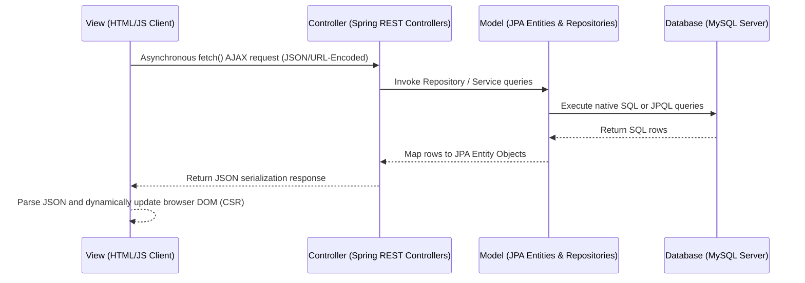

# BloodConnect — Donor & Request Matching System (Spring Boot Migration)

BloodConnect is a modern web application designed to connect patients or hospitals needing urgent blood with compatible, active blood donors in their immediate city. The system incorporates an automated matching engine, a 90-day donation cooldown eligibility rule, and administrator verification queues to mask donor contact details until urgency is validated.

This repository represents the **Spring Boot 3.x (Java 17)** migrated codebase, modernizing the application from the legacy Java Servlets/JSP architecture while maintaining full client-side HTML/JS API contract compatibility and database compatibility.

---

## 1. Project Architecture: Decoupled Client-Side Rendered (CSR) MVC

BloodConnect is designed around a decoupled **Model-View-Controller (MVC)** architectural pattern optimized for client-side API interaction:



### Transitioning from Java Servlets to Spring Boot
The application has transitioned from a legacy web container environment (Tomcat WAR deployment with raw servlets and JDBC statements) to a modern, lightweight Spring Boot environment:
*   **The View Layer is Static**: Decoupled HTML5 frontend views containing Vanilla JS and Tailwind CSS are served automatically from `src/main/resources/static/`. No server-side page compilation (JSP) is used.
*   **API-Centric Controller Mapping**: Controller classes annotated with `@RestController` expose Rest API endpoints matching the exact request parameter structures and JSON payloads expected by the frontend.
*   **Data Access Layer (JPA)**: Replaced boilerplate JDBC query connections, prepared statement creations, and ResultSet mappings with declarative **Spring Data JPA Repositories**, reducing repository code size by 80%.
*   **Logical Authorization Interceptor**: Intercepts requests using a Spring Boot `HandlerInterceptor` mapping (`AuthInterceptor`) to emulate Tomcat web filters, handling route security and dynamic page redirects seamlessly.

---

## 2. Directory and File Structure

Below is the directory tree of the migrated Spring Boot application:

```text
bloodconnect-springboot/
├── pom.xml                                 # Maven dependencies (Spring Boot, MySQL, JPA, BCrypt)
└── src/
    └── main/
        ├── java/
        │   └── com/
        │       └── bloodconnect/
        │           ├── BloodConnectApplication.java   # App entry point
        │           ├── config/
        │           │   └── WebConfig.java             # Interceptor mapping registry
        │           ├── controller/
        │           │   ├── AuthController.java        # Handles /login, /register, and /logout
        │           │   ├── DonorController.java       # Handles profile and match actions
        │           │   ├── RequestController.java     # Handles posting and finding matches
        │           │   └── AdminController.java       # Handles admin dashboard stats & verify
        │           ├── interceptor/
        │           │   └── AuthInterceptor.java       # Role checking security interceptor
        │           ├── model/
        │           │   ├── User.java                  # JPA Entity (users table)
        │           │   ├── DonorProfile.java          # JPA Entity (donor_profiles table)
        │           │   ├── BloodRequest.java          # JPA Entity (blood_requests table)
        │           │   └── DonorMatch.java            # JPA Entity (donor_matches table)
        │           ├── repository/
        │           │   ├── UserRepository.java
        │           │   ├── DonorProfileRepository.java # Custom native SQL eligibility queries
        │           │   ├── BloodRequestRepository.java
        │           │   └── DonorMatchRepository.java   # Custom native joins for dashboard metrics
        │           └── service/
        │               └── DatabaseInitializerService.java # Automatically seeds schema.sql on boot
        └── resources/
            ├── application.properties              # DB URL, credentials and dialect variables
            ├── schema.sql                          # MySQL Database DDL creation script
            └── static/                             # Decoupled static frontend files
                ├── index.html
                ├── login.html
                ├── register.html
                ├── donor-dashboard.html
                ├── requester-dashboard.html
                ├── request-form.html
                ├── match-results.html
                ├── admin-dashboard.html
                └── error.html
```

---

## 3. How JavaScript API Calls Connect to Spring Boot

In the decoupled setup, the client-side JavaScript communicates asynchronously with the backend controllers:

```text
  [Client Browser]                                      [Spring Boot Web Server]
  HTML/JS UI Pages                                       REST Controller Class
         │                                                         │
         │  1) fetch('/donor/profile', { method: 'POST',           │
         │           body: URLSearchParams("action=toggle") })     │
         ├────────────────────────────────────────────────────────>│  2) bind parameter:
         │                                                         │     @RequestParam("action") String action
         │                                                         │  3) run JPA repository / service logic
         │                                                         │  4) serialize response map:
         │  5) response.json() => update browser DOM nodes         │     returns Map / Entity (Spring writes JSON)
         │<────────────────────────────────────────────────────────┤
         v                                                         v
```

1.  **Request Construction**: The client initiates an AJAX HTTP request using the `fetch()` API. Parameters are serialized using `URLSearchParams` (URL-encoded payload).
2.  **Spring Parameter Binding**: The request hits a `@PostMapping` route. Parameters are automatically mapped to controller variables using `@RequestParam`.
3.  **JSON Response**: Spring Boot uses Jackson to serialize the return object (such as `ResponseEntity<Map<String, Object>>`) directly into a JSON output stream, returning standard HTTP codes (e.g. `200 OK`, `401 Unauthorized`, `403 Forbidden`).

---

## 4. How the Database Connection & Fallback Work

To maintain compatibility with local development environments and cloud platforms (such as Railway):
*   **Variable Substitution**: Spring Boot checks for environment variables `MYSQLHOST`, `MYSQLPORT`, `MYSQLDATABASE`, `MYSQLUSER`, and `MYSQLPASSWORD` inside `application.properties`.
*   **Fallback Defaults**: If variables are missing, it falls back to connection details `localhost:3306/bloodconnect` with user `rorr` and password `admin` to align with the database settings specified by the user.
*   **Explicit Dialect Setting**: The Hibernate dialect is explicitly set to `org.hibernate.dialect.MySQL8Dialect`. This avoids connection-negotiation failures and ensures metadata query resolution on initial startup even if database start is delayed.

---

## 5. Tailwind CSS & Glassmorphism Styling

Tailwind CSS styles the application interface using a dark theme with modern glassmorphism components:
*   **Styling CDN**: Linked directly in each HTML header to eliminate bundling complexity.
*   **Tailwind Colors**: Extended to incorporate blood-red colors (ranging from `#fef2f2` to `#450a0a`) for accents and status alerts.
*   **Glassmorphic Classes**: Uses backdrop filter class overlays:
    ```css
    .glass {
        background: rgba(255, 255, 255, 0.05);
        backdrop-filter: blur(20px);
        border: 1px solid rgba(255, 255, 255, 0.1);
    }
    ```

---

## 6. CRUD Operations in BloodConnect (JPA)

| Operation | Entity | Repository Method / Query |
| :--- | :--- | :--- |
| **Create** | User Registration | `userRepository.save(user)` |
| **Create** | Blood Request | `bloodRequestRepository.save(req)` |
| **Read** | Fetch User by Email | `userRepository.findByEmail(email)` |
| **Read** | Fetch Donor Profile | `donorProfileRepository.findById(donorId)` |
| **Read** | View Request Matches | `donorMatchRepository.getMatchesByRequestNative(requestId)` (native join query) |
| **Update** | Update Donor Profile | `donorProfileRepository.save(profile)` (performs UPDATE if ID is present) |
| **Update** | Update Match Status | `donorMatchRepository.save(match)` (updates status) |
| **Update** | Verify Blood Request | `bloodRequestRepository.save(req)` (sets `is_verified=true`) |
| **Delete** | Logical State Delete | *Logical deletion is used. Instead of executing SQL `DELETE`, the status of the request is logically updated to `CLOSED` or `FULFILLED` using standard JPA updates.* |

---

## 7. Automated Matching Engine

The matching logic routes new blood requests to active, eligible donors. The search filter is implemented in `DonorProfileRepository` using native queries:

### Core Matching Query:
```sql
SELECT d.* FROM donor_profiles d 
JOIN users u ON d.donor_id = u.user_id 
WHERE d.blood_group = :bloodGroup 
  AND LOWER(d.city) = LOWER(:city) 
  AND d.is_available = TRUE 
  AND (d.last_donation_date IS NULL OR DATEDIFF(CURDATE(), d.last_donation_date) > 90)
```
*   **Eligibility Rules**:
    1.  Blood group matches the requested type exactly.
    2.  The city matches the request location (case-insensitive conversion via `LOWER`).
    3.  Availability status `is_available` is true.
    4.  The donor's last donation date is either `NULL` or more than 90 days in the past (calculated using MySQL `DATEDIFF` against the current date).

---

## 8. Technical Interview Questions & Answers

### Q1: How do JavaScript `fetch()` API calls connect to the Java Servlets in this Client-Side Rendered (CSR) setup?
**Answer**: In the legacy servlet architecture, Java Servlets declare routing endpoints using annotations like `@WebServlet("/donor/profile")`. The client-side JavaScript sends an asynchronous request using the `fetch()` API. Parameters are encoded as `application/x-www-form-urlencoded` payloads using `URLSearchParams` and passed in the body. The servlet uses `request.getParameter()` to retrieve inputs, interacts with the DAO layer to process the database, serializes Java data structures to JSON via Google `Gson`, and outputs the stream to the response buffer.

### Q2: Explain the cloud-to-local fallback implementation in `DBConnection.java`.
**Answer**: To make the servlet application deployable without editing code, `DBConnection.java` uses `System.getenv()` to fetch database properties dynamically (`MYSQLHOST`, `MYSQLPORT`, etc.) which are standard on cloud platforms like Railway. If a connection attempt throws a `SQLException` (which occurs when running on a local machine without these variables), the exception block catches the error and executes a secondary fallback connection to `localhost:3306` with default credentials (`root` and empty password), ensuring the app runs in both settings.

### Q3: How does the Automated Matching Engine select eligible donors and calculate the 90-day cooldown period?
**Answer**: The matching engine utilizes a custom SQL join query that performs computations directly on the database server. It checks the eligibility parameters: exact blood group match, matching cities, availability status flag `TRUE`, and calculates the days elapsed since the donor's last donation using the MySQL `DATEDIFF(CURDATE(), last_donation_date)` function. If the diff is greater than 90 days or if the donation date is `NULL`, the donor is eligible.

### Q4: How are passwords secured in the database?
**Answer**: Plaintext passwords must never be stored. The application uses the **BCrypt** hashing algorithm via the `jbcrypt` library. The password utility `hashPassword()` generates a random cryptographic salt and computes the hash value. To authenticate, the utility runs `checkPassword()` to compare the login password against the stored hash.

### Q5: How does the application prevent SQL Injection?
**Answer**: To prevent SQL Injection, the application uses **PreparedStatements** (legacy) and **JPA Parameter Binding** (Spring Boot). Instead of concatenating user input strings directly into SQL queries, placeholders (`?` or named bind parameters `:param`) are used. The SQL engine compiles the query structure first, and then binds user inputs strictly as parameters, preventing inputs from being executed as SQL instructions.

### Q6: How does the application protect against Cross-Site Scripting (XSS) in CSR?
**Answer**: XSS occurs when user-submitted scripts are injected into web pages. To prevent this, the client-side JavaScript uses **`textContent`** or `createTextNode` instead of `innerHTML` when inserting data into the DOM. This causes the browser to escape and display data strictly as text, preventing the execution of malicious scripts.

### Q7: Explain the role of `AuthFilter.java` and how it handles routing for both static page requests and AJAX REST API calls.
**Answer**: `AuthFilter.java` intercepts all incoming requests to check sessions. For static page requests, if session attributes are missing, the filter redirects the user to `/login.html` via `response.sendRedirect()`. However, for AJAX API requests, redirecting would break the JavaScript client. The filter checks the request URI and, if it matches an API endpoint, returns an HTTP `401 Unauthorized` JSON message, allowing the JavaScript client to handle routing cleanly.

### Q8: How is the database schema initialized automatically on application startup without using CLI scripts?
**Answer**: In the legacy project, we use a `@WebListener` context listener (`DatabaseInitializer.java`). On startup, `contextInitialized()` runs, checks if the `users` table exists, and if not, reads the `/WEB-INF/schema.sql` script and executes statements using JDBC connections. In Spring Boot, this is handled by a `@Component` implementing `CommandLineRunner` that uses `ResourceDatabasePopulator` to run `schema.sql` automatically if the database tables are missing.

### Q9: How are donor phone numbers masked for privacy, and why must this masking happen server-side?
**Answer**: Donor phone numbers are masked dynamically (e.g. `98******12`) if a request is not yet verified by an administrator. This masking must be done on the server before serializing JSON responses. If raw numbers were sent to the client and masked using CSS or JavaScript, a malicious user could inspect the HTTP response payload in the browser console to reveal the unmasked numbers.

### Q10: Why do we use Google Gson in Java Servlets, and how is character encoding handled?
**Answer**: Java Servlets lack built-in JSON serialization. We use Google `Gson` to convert Java POJOs and HashMaps to JSON strings. To prevent character corruption (e.g. during serialization of names or special symbols), we set the HTTP headers explicitly:
```java
response.setContentType("application/json");
response.setCharacterEncoding("UTF-8");
```
This forces Tomcat to parse and output strings using standard UTF-8 encoding.

### Q11: Explain the difference between `getSession(true)` and `getSession(false)` as used in this application.
**Answer**: `getSession(true)` checks if a session exists. If not, it creates a new HTTP session and returns it. This is used in `LoginServlet` to initiate a session upon authentication. `getSession(false)` returns the current session if it exists, or returns `null` if it does not. This is used in authorization filters and APIs to check user status without creating empty session files in Tomcat's memory.

### Q12: How is role-based dashboard redirection managed when a user navigates to `/` (index.html)?
**Answer**: When index.html loads, JavaScript sends a `GET /login` request to the backend. If the session contains user details, the backend returns a JSON payload including the user's role (`DONOR`, `REQUESTER`, `ADMIN`). The JavaScript client then updates the navigation links dynamically to route the user to their corresponding portal page (e.g. `admin-dashboard.html`).

### Q13: How does the database design represent matching records, and how do we prevent duplicate entries?
**Answer**: Match records are stored in the `donor_matches` table, linking a `request_id` to a `donor_id`. To prevent duplicate match entries, the database schema defines a **composite unique key** constraint on the two columns:
```sql
UNIQUE KEY unique_match (request_id, donor_id)
```
If an automated match runs again, the database prevents duplicate entries.

### Q14: How is the Tomcat deployment configured in the project's build settings?
**Answer**: It uses Maven (`pom.xml`) with packaging set to `<packaging>war</packaging>`. The build includes the `maven-war-plugin` to package compiled Java classes from `target/classes` and static web assets from `src/main/webapp` into a single WAR file. This WAR file is then placed in Tomcat's `webapps` folder for deployment.

### Q15: What is the benefit of using the `WebListener` and `WebFilter` annotations over XML configurations?
**Answer**: Annotations keep configuration settings directly inside the Java source code instead of mapping them in `web.xml`. This makes the application easier to configure, reduces XML syntax errors, simplifies package refactoring, and aligns with modern servlet development practices.

### Q16: Why are database connections closed inside `finally` blocks or using try-with-resources in the DAOs?
**Answer**: Connections, PreparedStatements, and ResultSets are finite system resources. If left open, they remain active in the background, eventually exhausting the database connection pool. Using try-with-resources ensures these objects are closed automatically on block completion, even if SQL exceptions occur.

### Q17: What does the Tomcat welcome file configuration in `web.xml` do?
**Answer**: The `<welcome-file-list>` node tells Tomcat which file to serve by default when a user accesses the root context path (`/`). We set this to `index.html` so Tomcat serves our client-side landing page automatically.

### Q18: How does the application handle logical deletion of blood requests instead of physical deletion?
**Answer**: The application updates the status of the request to `CLOSED` or `FULFILLED` instead of executing a SQL `DELETE` query. This preserves historical records and donor matching history for auditing and reporting purposes.

### Q19: Explain the use of the `DATEDIFF` function in the matching query.
**Answer**: `DATEDIFF(date1, date2)` returns the number of days between two dates. In the matching query, we calculate the days elapsed since the donor last donated:
```sql
DATEDIFF(CURDATE(), last_donation_date) > 90
```
This filters out donors who are in their 90-day post-donation recovery window.

### Q20: Explain the error page routing configuration inside `web.xml`.
**Answer**: The `<error-page>` tags inside `web.xml` specify custom pages for common HTTP error codes. We mapped `404` and `500` status codes to route to `/error.html`, providing a dark glassmorphic error screen instead of default container traceback screens.

---

### Q21: What is the main difference between traditional Servlets and Spring Boot `@RestController`?
**Answer**: Traditional Servlets require extending `HttpServlet`, overriding lifecycle methods (`doGet`, `doPost`), handling HTTP response writers manually, and converting Java objects to JSON using third-party libraries like `Gson`. Spring Boot `@RestController` combines `@Controller` and `@ResponseBody`. It automatically maps HTTP methods using annotations (like `@GetMapping`), parses request data, and serializes Java return types (Maps, Entities, Lists) into JSON payloads automatically using Jackson.

### Q22: How does Spring Boot serve static resources (like HTML, CSS, JS) automatically?
**Answer**: Spring Boot configures standard directory resources automatically. Any files placed under directories like `src/main/resources/static/`, `public/`, or `resources/` are mapped directly to the root URL context path (`/`). If a user requests `/login.html`, Spring Boot looks for the file in those static directories and serves it directly.

### Q23: Why did we select a Spring `HandlerInterceptor` instead of standard Spring Security for this migration?
**Answer**: Standard Spring Security introduces a complex filter chain, cross-origin restrictions, default login redirects, and CSRF token validations. Integrating it would require modifying the client-side JavaScript AJAX requests. Using a custom `HandlerInterceptor` replicates the existing session-based `AuthFilter` logic exactly, allowing us to migrate the backend without changing a single line of frontend JavaScript.

### Q24: How does Spring Data JPA simplify database operations compared to raw JDBC DAOs?
**Answer**: In raw JDBC, every query requires writing boilerplate code: opening connections, building PreparedStatements, setting parameters, executing queries, looping through ResultSets, mapping fields to POJOs, handling exceptions, and closing resources. Spring Data JPA replaces this by allowing us to extend `JpaRepository`. Database CRUD operations (save, findById, delete) are implemented automatically.

### Q25: Explain the use of `@Entity` and `@Table` annotations in the migrated model classes.
**Answer**: 
*   `@Entity`: Marks a Java class as a JPA entity, indicating that it is mapped to a database table.
*   `@Table(name = "users")`: Specifies the name of the database table that this entity maps to. If omitted, JPA defaults to using the class name, which can lead to errors if the table name is plural or lowercase.

### Q26: How does the `@Id` annotation function in the `DonorProfile` entity where primary key generation is omitted?
**Answer**: In the database schema, the `donor_profiles` table uses `donor_id` as the primary key, which is also a foreign key referencing `users(user_id)`. Because the ID value is not generated automatically by the database but is set manually to match the user's ID, we declare `@Id` without a `@GeneratedValue` annotation. JPA treats the ID as assigned rather than auto-incremented.

### Q27: How does Spring Boot resolve environment variables in `application.properties` (e.g. `${MYSQLHOST:localhost}`)?
**Answer**: Spring Boot uses its environment property source resolvers. The syntax `${VARIABLE_NAME:DEFAULT_VALUE}` tells Spring Boot to search for an environment variable named `VARIABLE_NAME`. If it is found, its value is injected. If it is not found, the fallback `DEFAULT_VALUE` is used. This allows the application to connect to a cloud database (like Railway) when deployed, or fallback to a local database when run locally.

### Q28: What is the role of `spring-boot-starter-parent` in the `pom.xml` file?
**Answer**: The `spring-boot-starter-parent` acts as a parent POM, providing default configurations, plugin settings, and dependency management for Spring Boot applications. It defines compatible versions for Spring libraries and plugins, eliminating the need to declare versions for individual Spring dependencies in the POM.

### Q29: How did we handle date format conversion in `DonorController` when parsing `lastDonationDate`?
**Answer**: The frontend HTML form submits dates as string parameters in `yyyy-MM-dd` format. In `DonorController.java`, we parse this string using Java's `SimpleDateFormat` and convert it to a `java.sql.Date` instance before saving it to the database via JPA:
```java
SimpleDateFormat sdf = new SimpleDateFormat("yyyy-MM-dd");
java.util.Date parsedDate = sdf.parse(lastDonationDateStr);
java.sql.Date lastDonationDate = new java.sql.Date(parsedDate.getTime());
```

### Q30: How does `@RequestParam` bind form url-encoded data from client-side JavaScript in Spring Boot?
**Answer**: When client-side JavaScript sends requests with a `Content-Type` of `application/x-www-form-urlencoded`, the parameters are passed as key-value pairs in the request body. Spring Boot's `@RequestParam("paramName")` annotation extracts these parameters by name from the request payload and binds them to method arguments, handling type conversion automatically.

### Q31: How do transient fields (using the `@Transient` annotation) work in JPA entities like `BloodRequest` and `DonorMatch`?
**Answer**: Transient fields are class attributes used for display purposes that do not map to database columns. We annotate these fields with `@Transient` (such as `requesterName` in `BloodRequest` or `donorPhone` in `DonorMatch`). This tells the JPA provider (Hibernate) to ignore these fields during database persistence operations.

### Q32: Explain how the custom native SQL query `getMatchesByRequestNative` was structured in `DonorMatchRepository`.
**Answer**: The query performs native SQL joins across three tables (`donor_matches`, `users`, and `donor_profiles`) to fetch matching donor profiles and their contact info for a specific request. Because the return types span multiple tables, the repository method returns a list of raw object arrays `List<Object[]>`, which are then mapped to `DonorMatch` instances:
```java
@Query(value = "SELECT dm.match_id, dm.request_id, dm.donor_id, dm.status, dm.matched_at, " +
               "u.full_name AS donor_name, u.phone AS donor_phone, ... " +
               "FROM donor_matches dm JOIN users u ...", nativeQuery = true)
List<Object[]> getMatchesByRequestNative(@Param("requestId") int requestId);
```

### Q33: How does the Spring Boot application handle CORS issues, and did we need to configure it here?
**Answer**: Cross-Origin Resource Sharing (CORS) is a browser security mechanism that blocks requests made to a different domain. Because our frontend static files and REST API controllers are served from the same Spring Boot instance (running on the same domain and port), CORS configurations were not needed.

### Q34: What is the significance of the `@SpringBootApplication` annotation?
**Answer**: The `@SpringBootApplication` annotation is a convenience annotation that combines three annotations:
1.  `@SpringBootConfiguration`: Marks the class as a source of bean definitions.
2.  `@EnableAutoConfiguration`: Tells Spring Boot to configure beans automatically based on the classpath settings.
3.  `@ComponentScan`: Directs Spring to scan the current package and its subpackages for components, controllers, and services.

### Q35: Explain how `DatabaseInitializerService` implements `CommandLineRunner` to seed tables on startup.
**Answer**: In Spring Boot, any bean implementing `CommandLineRunner` has its `run()` method executed automatically after the application context is fully initialized. We use this to check if the database is configured, run the SQL schema creation script if tables are missing, and seed the default admin account.

### Q36: How does the `ResourceDatabasePopulator` execute the `schema.sql` script dynamically?
**Answer**: `ResourceDatabasePopulator` is a Spring utility class used to populate a database. In `DatabaseInitializerService`, we instantiate it, load the `schema.sql` script as a classpath resource, and execute it against the application's configuration:
```java
ResourceDatabasePopulator populator = new ResourceDatabasePopulator();
populator.addScript(new ClassPathResource("schema.sql"));
DatabasePopulatorUtils.execute(populator, dataSource);
```

### Q37: How do we map composite unique constraints in JPA repositories to avoid duplicate inserts?
**Answer**: While the database enforces the constraint using unique keys, we prevent duplicate records in the application by performing an existence check in the repository before saving. For example, `DonorMatchRepository` exposes `existsByRequestIdAndDonorId()`, which we call to verify a match doesn't exist before executing `.save()`.

### Q38: What is the difference between JPQL/HQL and native SQL queries in Spring Data JPA?
**Answer**: JPQL (Java Persistence Query Language) and HQL (Hibernate Query Language) write queries against Java entities and their properties rather than database tables and columns. Native SQL queries write raw SQL statements directly against the database tables. We used native queries (`nativeQuery = true`) in this project to perform database-specific operations like `DATEDIFF` and `FIELD` functions.

### Q39: How is the session handled in Spring Boot controllers using `HttpSession` parameters?
**Answer**: Spring Boot resolves session parameters automatically. When a controller method declares an `HttpSession` parameter, Spring injects the current HTTP session (or creates a new one). We use this session to save and retrieve session attributes like `userId`, `role`, and `userName`.

### Q40: How does `AuthInterceptor` simulate the behavior of a servlet `WebFilter` for dynamic versus API paths?
**Answer**: The interceptor's `preHandle()` method runs before requests hit controller routes. It checks the request path. If the session is invalid, the interceptor checks if the path is an API endpoint. If it is an API route, the interceptor returns an HTTP `401 Unauthorized` status with a JSON payload. For page routes, it redirects the user to `/login.html` via `response.sendRedirect()`.

### Q41: Explain how role-based authorization is enforced in `AuthInterceptor` for requests containing `/admin` or `/donor` in their paths.
**Answer**: The interceptor extracts the current user's role from the session. If the target URL path starts with `/admin` or `/admin-dashboard.html`, the interceptor verifies that the session role is `ADMIN`. If the path starts with `/donor` or `/donor-dashboard.html`, it verifies that the role is `DONOR`. If the role checks fail, the interceptor blocks the request and redirects the user or returns an HTTP `403 Forbidden` error.

### Q42: What is the purpose of `@ResponseBody` (implicit in `@RestController`) and how does it translate Java objects to JSON?
**Answer**: `@ResponseBody` tells Spring Boot that the object returned by a controller method should be bound directly to the HTTP response body. Spring Boot uses `HttpMessageConverter` implementations (such as Jackson) to automatically serialize Java types (like HashMaps or custom entities) into JSON output strings.

### Q43: How is the application packaged into an executable JAR, and how does it run an embedded Tomcat server?
**Answer**: By using the `spring-boot-maven-plugin` in `pom.xml`, the command `mvn package` builds an executable **JAR** file containing all compiled code, resources, and dependencies. The JAR also packages an embedded Tomcat server, allowing the application to be launched using `java -jar app.jar` without needing an external Tomcat installation.

### Q44: Why did we use `DATEDIFF` inside the JPA native query instead of parsing Java Date objects inside memory?
**Answer**: Running calculations on the database server is much faster than loading all records into Tomcat's memory and filtering them using Java code. By running `DATEDIFF` inside the MySQL query, the database server filters out ineligible donors directly, reducing database query overhead.

### Q45: How does the Spring Boot application ensure that resource cleanup (like closing database connections) happens automatically?
**Answer**: Spring Boot integrates **HikariCP** as its default connection pool. HikariCP manages opening, reusing, and closing database connections automatically. When JPA repository methods finish executing, the connection is returned to the pool, preventing database resource leaks.

### Q46: How does the application mask donor phone numbers dynamically on matching results without exposing them to the client browser?
**Answer**: Inside `RequestController.java`'s `/match/find` endpoint, the controller checks if the request is verified. If `isVerified` is false, it replaces the middle digits of the phone number string with asterisks (e.g. `98******12`) before returning the match list as JSON. This ensures unmasked phone numbers are never transmitted over the network.

### Q47: What is the function of the `@Autowired` annotation in Spring dependency injection?
**Answer**: `@Autowired` resolves and injects collaborating beans (such as repositories or services) into Spring components automatically. This eliminates manual instantiation code (`new UserDAO()`), decoupling the layers of the application.

### Q48: How are validation errors (like invalid age or date format) handled and returned to the client in `DonorController`?
**Answer**: `DonorController.java` checks form values before executing updates. If validation errors occur, it appends messages to a `StringBuilder`, sets the response status to `400 Bad Request`, and returns a JSON payload containing the validation error messages, which the frontend displays in an alert banner.

### Q49: Explain the mapping of enum columns (like `urgency` or `status` in MySQL) to standard `String` fields in JPA entities.
**Answer**: MySQL enum values are returned as string values by the JDBC driver. By mapping them as standard Java `String` fields in our entities (like `String urgency`), JPA handles saving and reading these enum values seamlessly, avoiding complex mappings.

### Q50: How do you configure Spring Boot to use a custom port (like Railway's `$PORT`) instead of the default port `8080`?
**Answer**: In `application.properties`, we configure `server.port=${PORT:8080}`. This tells Spring Boot to search for an environment variable named `PORT` (which cloud hosting platforms like Railway inject automatically). If it exists, Spring Boot uses it. If not, it uses the default port `8080`.

---

## 9. Local Setup and Build Instructions

### Prerequisites
*   **Java JDK 17**
*   **Apache Maven**
*   **MySQL Server**

### Database Setup
Ensure MySQL is running. The default local configuration matches:
*   **Username**: `rorr`
*   **Password**: `admin`
*   **Database**: `bloodconnect`

The application's `DatabaseInitializerService` checks for database tables and runs the `schema.sql` script automatically on startup.

### Running the Application
To run the Spring Boot application locally:
```bash
mvn spring-boot:run
```
Once started, open a browser and visit:
`http://localhost:8080`
